# Workplace Gender Equality in Australia

An exploratory data analysis of workplace gender equality in Australia using publicly available data from the Workplace Gender Equality Agency (WGEA) and the Australian Bureau of Statistics (ABS).

---

## Overview

The Workplace Gender Equality Agency (WGEA) is an Australian Government statutory agency created by the *Workplace Gender Equality Act 2012*. Its purpose is to collect workforce data from employers and work with them to improve gender equality.

This project analyses the 2023–2024 private sector employer reports (employers with 100+ employees) to investigate the gender pay gap, workforce composition, and whether CEO gender influences company action on pay equality.

**Key statistic:** The national gender pay gap according to the ABS is **11.5%**. As of May 2025, full-time adult average weekly ordinary time earnings were \$2,106.40 for men and \$1,864.10 for women.

---

## Key Findings

- The gender pay gap has narrowed over the past decade but persists across all industries
- The pay gap exists at every skill level and tends to widen at higher skill levels (as captured by the Glass Ceiling Index)
- Companies with majority-female CEOs were more likely to have formal pay equality policies and to have taken corrective action
- The Health Care industry presents a paradox: the highest share of female workers, the largest pay gap, yet the closest to CEO gender parity

---

## Data Sources

| File | Description |
|------|-------------|
| `wgea_workforce_management_statistics_2024.csv` | Employee counts by industry, employer size, management category, employment status, and gender |
| `wgea_workforce_composition_2024.csv` | Workforce composition including occupation breakdowns (e.g. CEOs), corporate group names, and employee counts |
| `historical_wages.csv` | Historical mean weekly earnings by gender from the ABS, spanning 1975–2025 |
| `FY24.csv` | FY2023-24 ABS earnings data broken down by industry, gender, skill level, and employment category |
| `wgea_questionnaire_action_on_gender_equality_2024.csv` | Employer responses to the WGEA questionnaire on gender equality policies and actions |

---

## Analysis Sections

### 1. Historical Pay Gap Trends

Tracks how mean weekly earnings for men and women have diverged over time (1975–2025) and plots the gender pay gap (GPG) as a percentage over the same period. The GPG is defined as:

$$GPG = \frac{(Male\ Average - Female\ Average)}{Male\ Average} \times 100$$

### 2. Gender Split of the Workforce

Examines the overall workforce composition across 5,155,750 employees (2,515,212 men and 2,640,538 women) with breakdowns by:
- Full-time employees by gender
- Part-time employees by gender
- Overall employment status distribution

### 3. Gender Distribution by Industry

The male/female split across all ANZSIC industry divisions. A parity line at 50% highlights which industries are male- or female-dominated. A standardised male-to-female ratio is also computed per industry.

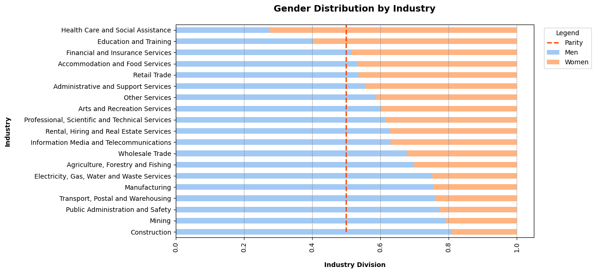

### 4. Gender Pay Gap by Industry

Comparison of mean male and female earnings across industries using ABS FY24 data.

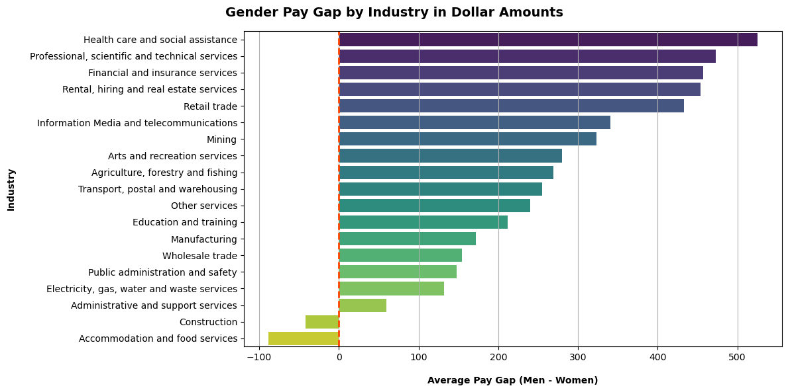

### 5. Skill Level Analysis

Analyses pay gaps across ABS skill levels (1–5, from bachelor degree to secondary education). This section includes:

- **Pay gap by skill level** across all industries, with employee count overlays
- **Industry deep-dives** into Health Care and Construction
- **Glass Ceiling Index (GCI):** Compares the female-to-male pay ratio at the lowest skill level vs the highest. A GCI below 1 indicates the gap widens at higher skill levels

> **Note:** Real Estate wages are largely commission-based, making that industry's data unreliable for this analysis.

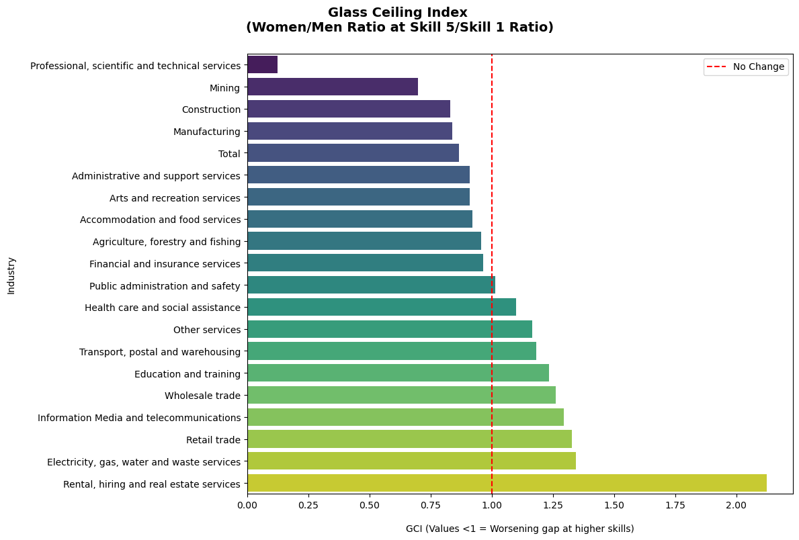

### 6. CEO Gender Split by Industry

Examines the gender distribution of CEOs across industries (excluding Specsavers as an outlier with 434 male and 428 female CEOs). Plotted as a stacked bar chart with a parity line.

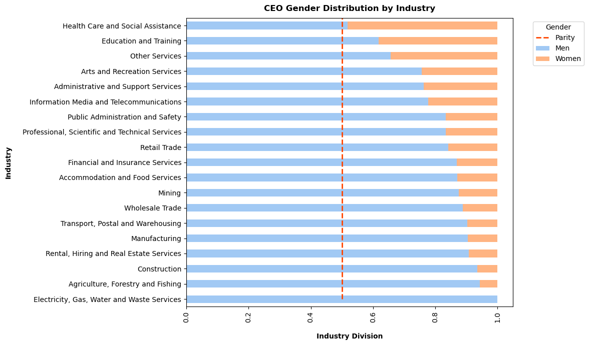

### 7. Workplace Equality Questionnaire

Analyses employer responses to three WGEA survey questions about gender pay equality:

| Question | Description |
|----------|-------------|
| **Q2.1** | Do you have formal policies/strategies on equal remuneration? |
| **Q2.2** | Have you analysed your payroll for remuneration gaps? |
| **Q2.2c** | Did you take action as a result of your gap analysis? |

**Answer codes:** Y = Yes, N = No, Dev = In Development, Clik = Corrected instances of unequal pay, TOrg = Set targets to reduce gaps

Responses are broken down both overall and by the gender ratio of each company's CEO(s).

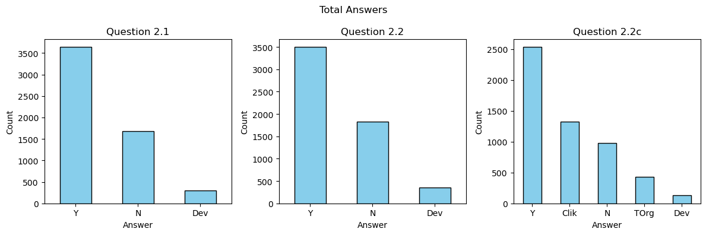
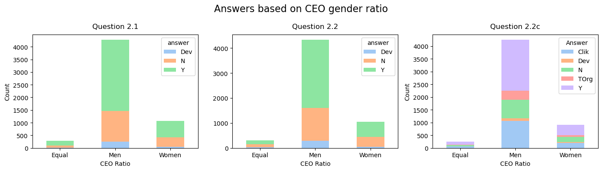

### 8. Hypothesis Testing

**Hypothesis:** CEO gender determines action on gender pay equality.

The Health Care industry is highlighted as a case study — it has the largest proportion of women in its workforce, the largest pay gap, yet is closest to parity in CEO gender.

Statistical tests performed:
- **Chi-square goodness-of-fit tests** comparing Health Care's distribution of CEO ratios and questionnaire answers against the overall dataset

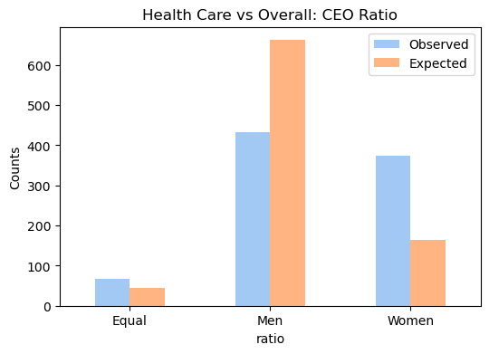
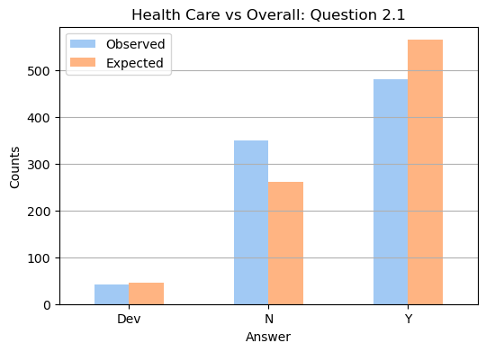
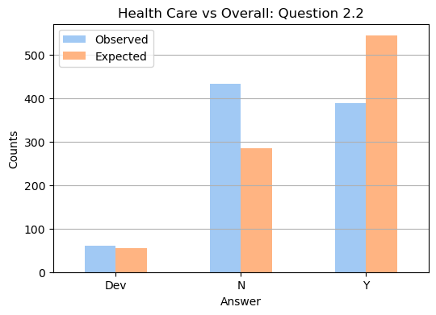
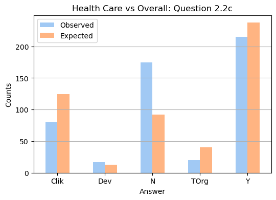
- **Heatmaps** showing the relationship between CEO gender ratio and questionnaire responses across all industries for each question
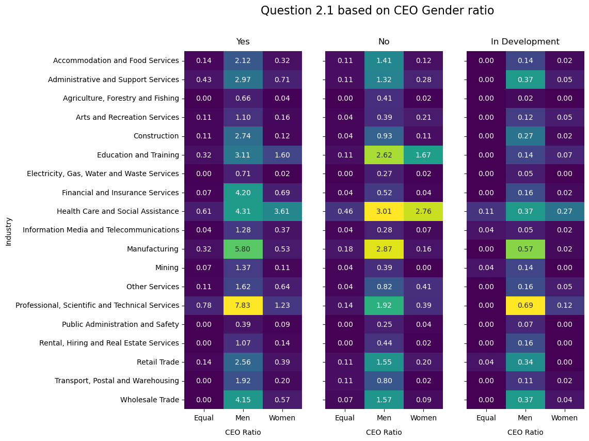
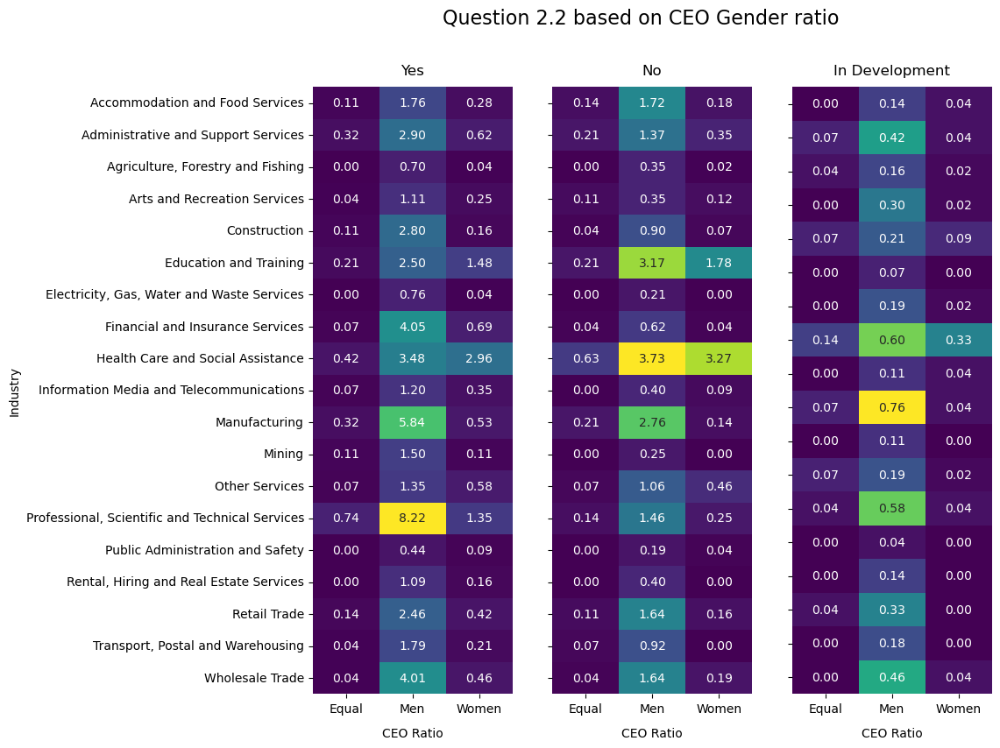
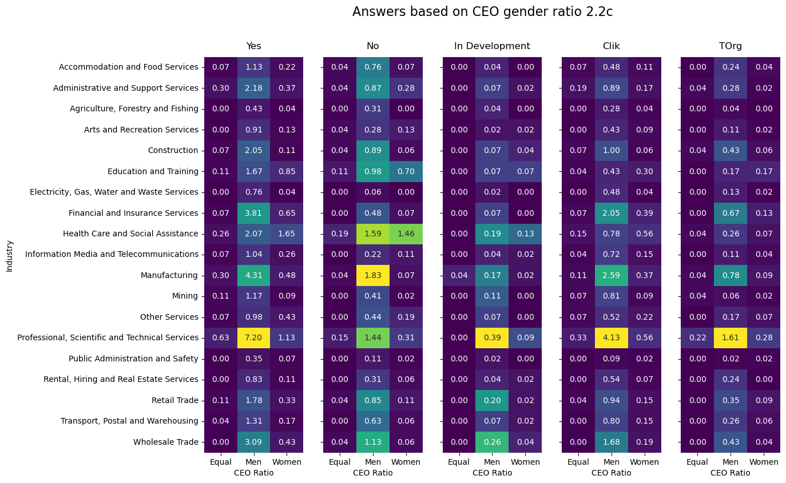
